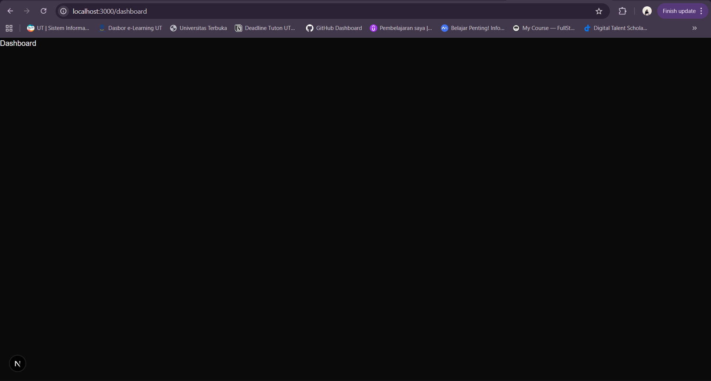
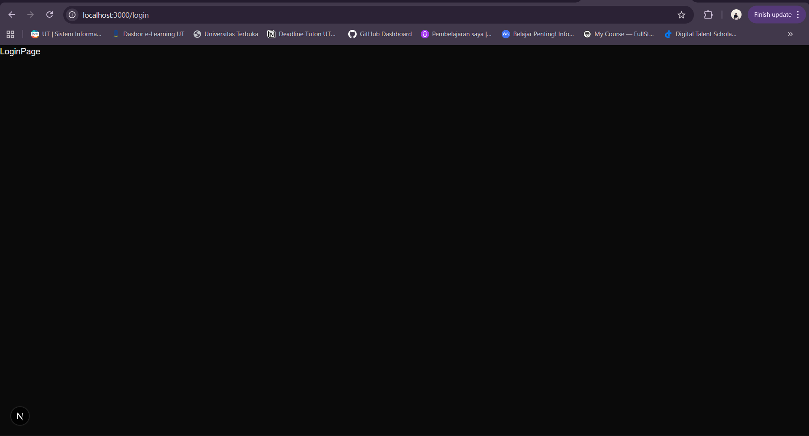

## 🚀 Tugas Next JS 1 - Setup Next.js, Husky, dan Routing Dasar

### 🎯 Tujuan Tugas
- Memahami Rendering pada Next.js  
- Memahami perbedaan Next.js dengan React murni (SPA Only)  
- Memahami Struktur Project Next.js  
- Dapat melakukan Setup Dasar Next.js  
- Dapat Membuat Routing Dasar pada Next.js  

---

### 🧩 Langkah Pengerjaan

#### A. Setup Next.js
Project dibuat menggunakan perintah berikut:

```bash
bunx create-next-app@latest .
```
Pilihan yang digunakan:

- TypeScript: Yes

- Linter (ESLint): Yes

- Tailwind CSS: Yes

- src/ directory: Yes

- App Router: Yes (recommended)

- Turbopack: Yes (recommended)

- Alias @/*: Default
<br>

#### B. Setup Husky (lint-staged & commitlint)

- Tambahkan dependency berikut:

```bash
bun add -D husky lint-staged @commitlint/config-conventional @commitlint/cli
bunx husky init
```
- Kemudian buat hook di dalam folder ``.husky``:

```bash
pre-commit

pre-commit.ps1

commit-msg

commit-msg.ps1
```

- Isi file sesuai konfigurasi standar yang sudah diajarkan (lint-staged + commitlint).
<br>

#### C. Setup Shadcn/UI

Mengikuti dokumentasi resmi Shadcn untuk Next.js:
Shadcn UI Docs

Langkah utama:

```bash
bunx shadcn-ui@latest init
```
<br>

#### D. Membuat Routing Dasar

Tambahkan halaman baru Dashboard:

__📂 Struktur folder:__

src/
 └── app/
      ├── page.tsx         → Halaman utama (Home)
      └── dashboard/
           └── page.tsx    → Halaman Dashboard
      └── login/
           └── page.tsx    → Halaman Login


Isi contoh ``src/app/dashboard/page.tsx``:

```js
const Dashboard = () => {
  return <div>Dashboard</div>;
};
export default Dashboard;
```
Isi contoh ``src/app/login/page.tsx``:

```js
const LoginPage = () => {
  return <div>LoginPage</div>;
};
export default LoginPage;
```
<br>

### 📖 Dokumentasi
🔹 Fitur yang Dibuat

- Setup Next.js dengan Bun

- Konfigurasi Husky + Commitlint untuk menjaga kualitas commit

- Integrasi Shadcn/UI untuk styling komponen UI

- Routing Dasar dengan menambahkan halaman /dashboard
<br>

### ⚡ Cara Menjalankan Project
```bash
bun install
bun dev
```
<br>

### 📷 Screenshot
- Tampilan halaman dashboard

<br>
- Tampilan halaman login
