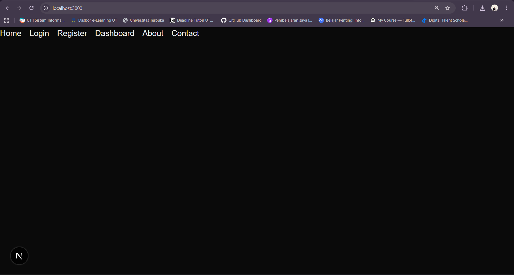

## 🚀 Tugas 2 - Next.js

### 🎯 Tujuan Tugas
- Memahami **Routing** pada Next.js  
- Memahami kegunaan **Metadata** dan implementasinya pada Next.js  
- Memahami penggunaan **Navigation** pada Next.js  
- Membuat **Middleware** sebagai proteksi route  

---

### 🧩 Langkah Pengerjaan

#### 1. Routing di Next.js
- Membuat folder dan file di dalam `app/` untuk otomatis jadi route.  
src/
└── app/
    ├── (auth)/
    │   ├── login/
    │   │   ├── _component/
    │   │   └── page.tsx
    │   └── register/
    │       └── page.tsx
    │
    ├── dashboard/
    │   └── @main/
    │       ├── layout.tsx
    │       └── page.tsx
    │
    ├── feed/
    │   └── (.)post/
    │       └── page.tsx
    │
    ├── user/
    │   └── [[...slug]]/
    │       └── page.tsx
    │
    ├── page.tsx
    └── middleware.ts

Keterangan singkat:

- (auth) → folder grouping route khusus (bisa login & register).

- @main → folder parallel route buat dashboard.

- (.)post → route intercepting di dalam feed.

- [[...slug]] → catch-all optional route buat user.

Akses via browser:  
``"/" → Home``
``"/login" → Login``
``"/dashboard" → Dashboard``
<br>

#### 2. Metadata
- Tambahkan metadata di tiap halaman menggunakan ``export const metadata``.  
- Contoh:
```tsx
export const metadata = {
  title: "Dashboard",
  description: "Ini adalah halaman Dashboard",
};
```
<br>

#### 3. Navigation

- Gunakan komponen ``Link`` dari ``next/link`` untuk navigasi antar halaman.

- Contoh:

```tsx
import Link from "next/link";

export default function Navbar() {
  return (
    <nav>
      <Link href="/">Home</Link>
      <Link href="/about">Login</Link>
      <Link href="/dashboard">Dashboard</Link>
    </nav>
  );
};
```
<br>

#### 4. Middleware (Proteksi Route)

- Buat file ``middleware.ts`` di root project.

- Contoh: hanya user login yang bisa akses ``/dashboard``.

```tsx
import { NextResponse } from "next/server";
import type { NextRequest } from "next/server";

export function middleware(request: NextRequest) {
  const isLoggedIn = false; // ganti sesuai logic auth

  if (!isLoggedIn && request.nextUrl.pathname.startsWith("/dashboard")) {
    return NextResponse.redirect(new URL("/", request.url));
  }

  return NextResponse.next();
}

export const config = {
  matcher: ["/dashboard/:path*"],
};
```
<br>

#### 📌 Catatan

Jalankan project dengan:
```bash
bun dev
```
<br>

#### 📷 Screenshot
- Halaman Home

<br>

- Halaman Login

<br>

- Halaman Dashboard
